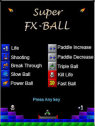

# Super-fx-ball
A classical brick breaking adventurous game for J2ME based mobile phone. It is similar like popular DX Ball game for Windows. 

    
    
    
    

    
    
    

	

<a href="dist/Super%20FX-BALL.jar">Download J2ME Super FX BALL Game</a>

## Features

-> 60 different levels  
-> Animation makes every second enjoyment 
-> Beautiful and attractive graphics 
-> Event based sounds make game enjoyable. 
-> Game becomes difficult over time. 
-> Bonus points. 
-> High score. 

## Development
CLDC 1.0 &amp; MIDP 2.0

I developed this game in 2007 by Java for J2ME platform. At that time I had Nokia Phone which supports J2ME. At that time J2ME was quite popular. I was a student of computer science when I built this game. Recently I thought lets share the code with other people if it helps them.

I used NetBeans IDE to develop and build the game.

## Questions or feedback?

Feel free to contact me [@mahmudahsan on Twitter](https://twitter.com/mahmudahsan).
